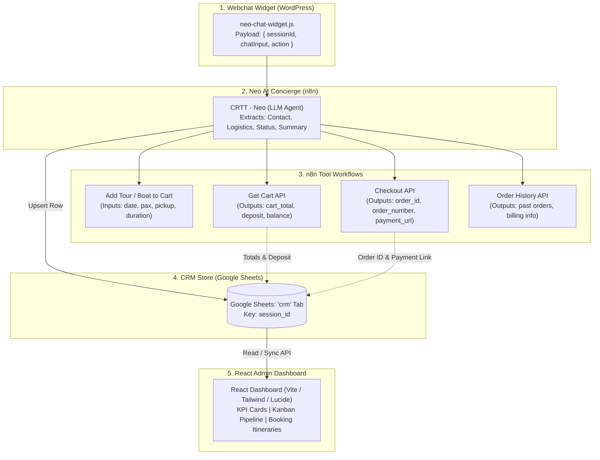

# CRTT CRM Schema & React Dashboard Specifications

> **Scope:** Google Sheets CRM Enhancement & React Analytics Dashboard  
> **System:** Costa Rica Transfers & Tours (CRTT) AI Booking System  
> **Backend Integration:** n8n Workflows + WooCommerce REST API + Google Sheets + OpenAI (GPT-4o-mini)  
> **Alignment Status:** 100% Verified against existing n8n sub-workflows and WooCommerce parameters.

---

## Table of Contents
1. [Executive Summary](#1-executive-summary)
2. [Data Source Architecture](#2-data-source-architecture)
3. [Workflow-Aligned CRM Column Schema](#3-workflow-aligned-crm-column-schema)
4. [Data Capture & Extraction Flow](#4-data-capture--extraction-flow)
5. [React Analytics Dashboard Blueprint](#5-react-analytics-dashboard-blueprint)
6. [Implementation Steps](#6-implementation-steps)

---

## 1. Executive Summary

This document specifies the enhanced data model for the CRTT Google Sheets CRM store (`crm` tab in spreadsheet `1qMTLCPL2yhU1DSU_TU0S9DrU2zhRvNv1lO5dWyGb37M`) and outlines the UI/UX architecture for a dedicated React-based CRM Analytics Dashboard.

### Core Objectives:
1. **Zero Fluff / 100% Extractability:** Include only columns that are directly populated by the chat widget payload, Neo LLM extraction, sub-workflow tool outputs, or WooCommerce Store/REST APIs.
2. **Business & Revenue Focus:** Enable tracking of active leads, cart values, 25% deposit requirements, 75% arrival balances, and tour itineraries.
3. **Dashboard Readiness:** Provide clean, structured data for KPI cards, Kanban lead funnels, upcoming tour calendars, and guest management tables.

---

## 2. Data Source Architecture



---

## 3. Workflow-Aligned CRM Column Schema

Every column below is grounded in existing workflow nodes, tool inputs/outputs, or WooCommerce parameters.

| # | Column Name | Data Type | Source Node / Workflow | Example Value | Business & Dashboard Purpose |
|---|---|---|---|---|---|
| 1 | `session_id` | String (Key) | `Webhook Webchat` (`body.sessionId`) | `ses_98f4a12c` | Unique conversation identifier & lookup key. |
| 2 | `name` | String | Neo LLM (`<CRM>`) / Checkout Tool | `John Doe` | Guest full name for reservation and billing. |
| 3 | `email` | String | Neo LLM (`<CRM>`) / Cart / Checkout | `john@example.com` | Primary customer identifier across WooCommerce & Cart. |
| 4 | `phone` | String | Neo LLM (`<CRM>`) / Checkout Tool | `+1-555-0199` | Guest phone for WhatsApp concierge & dispatch. |
| 5 | `status` | Dropdown | Neo LLM (`<CRM>`) | `new`, `engaged`, `carted`, `booked`, `cold` | Funnel stage for Kanban pipeline & conversion metrics. |
| 6 | `target_service` | String | Tool: `Add Tour` / `Add Boat` | `Sunset Catamaran Charter` | Name of the primary tour or charter inquired/carted. |
| 7 | `booking_date` | Date (YYYY-MM-DD) | Tool: `Add Tour` / `Add Boat` | `2026-11-15` | Requested date of activity for itinerary planning. |
| 8 | `pax_count` | Number | Tool: `Add Tour` / `Add Boat` | `6` | Total passenger count for capacity & transport planning. |
| 9 | `pickup_location` | String | Tool: `Add Tour` / `Add Boat` | `Four Seasons Papagayo` | Hotel, villa, or town in Guanacaste for dispatch. |
| 10 | `duration` | String | Tool: `Add Boat Charter` | `4 Hours (Morning)` | Duration option selected (applicable for boat charters). |
| 11 | `cart_total` | Number (USD) | Tool: `Get Cart API` | `1800.00` | Gross booking value for revenue forecasting. |
| 12 | `deposit_due` | Number (USD) | Tool: `Get Cart API` | `450.00` | 25% deposit amount required via PayPal. |
| 13 | `balance_due` | Number (USD) | Tool: `Get Cart API` | `1350.00` | 75% balance payable upon arrival in Costa Rica. |
| 14 | `order_id` | Number / String | Tool: `Checkout API` | `10428` | WooCommerce Order ID once checkout is triggered. |
| 15 | `order_number` | String | Tool: `Checkout API` | `#10428` | Customer-facing WooCommerce order reference. |
| 16 | `payment_url` | URL | Tool: `Checkout API` | `https://paypal.com/checkout?...` | Direct PayPal link for 1-click re-engagement. |
| 17 | `interests` | String / Tags | Neo LLM (`<CRM>`) | `Snorkeling, Marine Life` | Customer interests for personalized recommendations. |
| 18 | `special_requests` | Text | Tool: `Checkout API` (`customer_note`) | `Vegetarian lunch, 2 child vests` | Operational notes for guides and boat captains. |
| 19 | `preferred_language` | String | Neo LLM (`<CRM>`) | `English` | Detected customer language (`English`, `Spanish`, etc.). |
| 20 | `session_summary` | Text | Neo LLM (`<CRM>`) | `Inquired about catamaran charter for 6 pax, carted, waiting on payment.` | AI summary for human concierge quick-brief. |
| 21 | `created_at` | Timestamp | n8n Expression (`$now`) | `2026-09-01T10:15:00-06:00` | Record creation timestamp (UTC-6 Costa Rica). |
| 22 | `last_updated` | Timestamp | n8n Expression (`$now`) | `2026-09-01T10:45:00-06:00` | Last activity timestamp for stale-lead detection. |

---

## 4. Data Capture & Extraction Flow

### Step A: Inbound Chat & Session Lookup
* `Webhook Webchat` receives `{ sessionId, chatInput, action }`.
* `Lookup CRM Profile` queries `crm` sheet by `session_id`.
* Existing guest context is passed into `User Profile` node.

### Step B: Neo LLM Structured Output
Neo outputs clean HTML for the user bubble and appends the structured JSON block:
```json
<CRM>
{
  "name": "John Doe",
  "email": "john@example.com",
  "phone": "+1-555-0199",
  "status": "carted",
  "target_service": "Sunset Catamaran Charter",
  "booking_date": "2026-11-15",
  "pax_count": 6,
  "pickup_location": "Four Seasons Papagayo",
  "duration": "4 Hours",
  "interests": "Snorkeling, Sunset",
  "preferred_language": "English",
  "session_summary": "Inquired for 6 guests on Nov 15 from Papagayo, added 4-hour charter to cart."
}
</CRM>
```

### Step C: Parse & Upsert in n8n
* `Parse AI Tags` extracts the JSON block and strips `<CRM>` from the user-facing HTML.
* `Has CRM Data?` filter checks if any CRM payload exists.
* `Upsert CRM Row` executes `appendOrUpdate` matching on `session_id`.

---

## 5. React Analytics Dashboard Blueprint

### High-Level Dashboard Structure
```
+-------------------------------------------------------------------------------------------------------+
|  CRTT CONCIERGE & REVENUE ANALYTICS                                                  [Filter: Guanacaste] |
+-----------------------+-----------------------+-----------------------+-------------------------------+
|  TOTAL PIPELINE VALUE |  25% DEPOSITS PAID    |  ARRIVALS BALANCE DUE |  CART-TO-BOOK CONVERSION      |
|      $42,800.00       |      $10,700.00       |      $32,100.00       |            38.5%              |
+-----------------------+-----------------------+-----------------------+-------------------------------+
| [ KANBAN LEAD PIPELINE ]                                                                             |
|  * New Inquiries (14)  * Engaged (9)          * Carted / Pending (6)   * Confirmed Bookings (22)       |
|    - Alex (Tamarindo)    - Dave (ATV Tour)      - John ($1,800)          - Sarah (#10425 - $2,400)    |
|                                                 [1-Click Resend Link]                                 |
+-------------------------------------------------------------------------------------------------------+
| [ UPCOMING ITINERARY CALENDAR & DISPATCH TABLE ]                                                      |
|  Date       | Guest Name     | Service                   | PAX | Pickup Zone           | Status       |
|  2026-11-15 | John Doe       | Sunset Catamaran Charter  | 6   | Four Seasons Papagayo | 25% Paid     |
|  2026-11-16 | Maria Garcia   | Guachipelin Adventure     | 4   | Westin Reserva Conchal| Confirmed    |
+-------------------------------------------------------------------------------------------------------+
| [ TOP SERVICES & DEMAND BREAKDOWN ]                   | [ AI CONCIERGE INSIGHTS ]                     |
|  1. Sunset Catamaran Charter (42% of revenue)         | - Avg Turn Count to Book: 6.2 messages        |
|  2. Mega Combo Buena Vista (28% of revenue)           | - Top Inquired Region: Papagayo Peninsula     |
|  3. Sport Fishing Half Day (18% of revenue)           | - Most Common Language: English (88%)         |
+-------------------------------------------------------------------------------------------------------+
```

### Core React Components:
1. `MetricCard.jsx`: Reusable KPI summary cards with trend indicators.
2. `PipelineKanban.jsx`: Drag-and-drop or column view of leads by `status` (`new` &rarr; `engaged` &rarr; `carted` &rarr; `booked`).
3. `ItineraryTable.jsx`: Filterable data table (by Date, Pickup Location, Service, Payment Status) with export to CSV.
4. `LeadDetailModal.jsx`: Full guest profile drawer showing chat summary, passenger details, WooCommerce order ID, and 1-click PayPal payment link.
5. `DispatchCalendar.jsx`: Month/Week view showing scheduled boat charters and tours to avoid double-bookings.

---

## 6. Implementation Steps

1. **Update Google Sheets CRM Header Row**: Add the enhanced columns (1 to 22) in the `crm` tab.
2. **Update `ZeNz4VZTUkNMPhOP_crtt_-_neo.json`**:
   - Refine system prompt `<CRM>` instruction to include the new fields.
   - Update `Upsert CRM Row` column mappings.
3. **Build React Dashboard App**:
   - Initialize Vite + React project.
   - Build API connector (read Google Sheets via SheetDB / Google Sheets API or n8n Webhook).
   - Implement Dashboard layout, Kanban board, Itinerary table, and KPI summaries.
