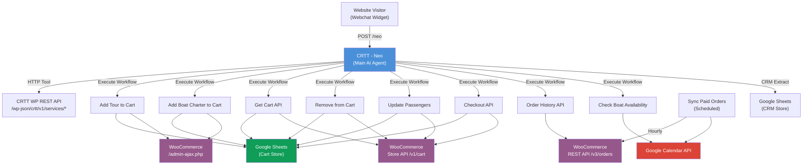
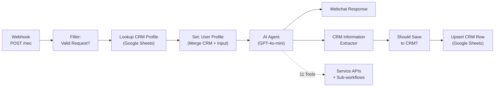
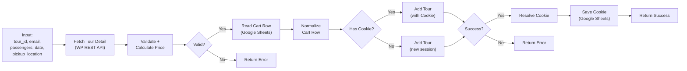
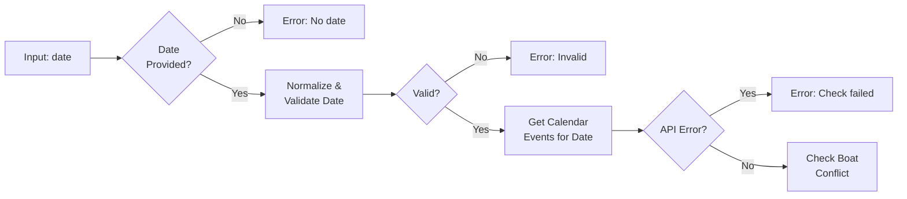
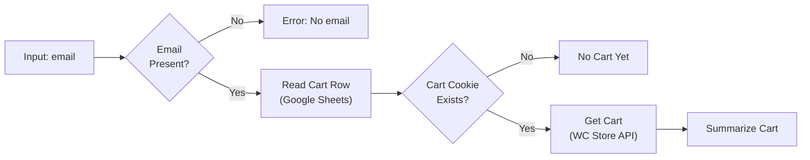
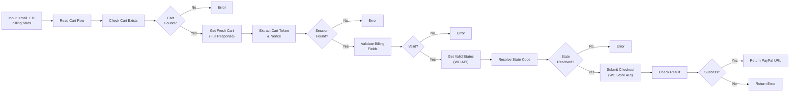
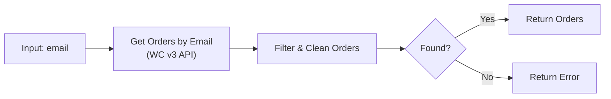

# CRTT n8n Workflow System — Comprehensive Analysis

> **Date:** August 26, 2026  
> **Scope:** 10 workflows powering the Costa Rica Transfers & Tours AI booking system  
> **Backend:** WooCommerce (WordPress) + Google Sheets (cart/CRM) + Google Calendar + OpenAI (GPT-4o-mini)

---

## Table of Contents

1. [System Architecture Overview](#1-system-architecture-overview)
2. [Main Flow: NEO (AI Agent)](#2-main-flow-neo-ai-agent)
3. [Sub-flow Analyses](#3-sub-flow-analyses)
   - [Add Tour to Cart API](#31-add-tour-to-cart-api)
   - [Add Boat Charter to Cart API](#32-add-boat-charter-to-cart-api)
   - [Check Boat Charter Availability](#33-check-boat-charter-availability)
   - [Get Cart API](#34-get-cart-api)
   - [Remove from Cart API](#35-remove-from-cart-api)
   - [Update Cart Item Passengers API](#36-update-cart-item-passengers-api)
   - [Checkout API](#37-checkout-api)
   - [Order History API](#38-order-history-api)
   - [Sync Paid Orders to Google Calendar](#39-sync-paid-orders-to-google-calendar)
4. [Critical Issues & Bugs](#4-critical-issues--bugs)
5. [Efficiency Issues](#5-efficiency-issues)
6. [Security Concerns](#6-security-concerns)
7. [How We Can Do Better — Recommendations](#7-how-we-can-do-better--recommendations)
8. [Priority Matrix](#8-priority-matrix)

---

## 1. System Architecture Overview



### Key Design Decisions

| Decision | Current Approach | Implications |
|----------|-----------------|--------------|
| Cart Session Storage | Google Sheets row per email | Scalability bottleneck; no concurrency control |
| Cart Session Identity | WooCommerce `set-cookie` stored as string | Cookie expiry not tracked; can go stale |
| AI Model | GPT-4o-mini | Cost-effective but weaker reasoning for complex multi-tool chains |
| CRM Data Store | Google Sheets (same spreadsheet, different tab) | Will hit Google Sheets API quotas at scale |
| Boat Availability | Google Calendar event check | Works but tightly coupled to calendar event description format |
| Payment | PayPal via `ppcp-gateway` | Single payment method, no fallback |

---

## 2. Main Flow: NEO (AI Agent)

**Workflow:** `CRTT - Neo` (`ZeNz4VZTUkNMPhOP`)  
**Trigger:** Webhook POST to `/neo`  
**Node Count:** ~25 nodes  

### Flow Diagram



### Nodes Breakdown

| Node | Type | Purpose |
|------|------|---------|
| Webhook Webchat | Webhook | Receives POST from webchat widget |
| Valid Request | Filter | Only allows `sendMessage` or `quickAction` actions |
| Lookup CRM Profile | Google Sheets | Reads existing CRM row by `session_id` |
| User Profile | Set Node | Merges webhook body with CRM data into a unified profile |
| AI Agent | LangChain Agent | GPT-4o-mini with 11 tools and massive system prompt |
| Simple Memory | Buffer Window Memory | 20-message context window per session |
| Webchat Response | Respond to Webhook | Returns AI output to the widget |
| CRM Information Extractor | LangChain Extractor | Second GPT-4o-mini call to extract structured CRM data |
| Should Save to CRM? | Filter | Only persists if `should_save === true` |
| Upsert CRM Row | Google Sheets | Writes/updates CRM profile |

### Connected Tools (11 total)

| Tool | Type | Sub-workflow |
|------|------|-------------|
| Get All Services | HTTP Request Tool | Direct API call |
| Get Tours | HTTP Request Tool | Direct API call |
| Get Boat Charters | HTTP Request Tool | Direct API call |
| Get Transportation | HTTP Request Tool | Direct API call |
| Get Tour Detail | HTTP Request Tool | Direct API call |
| Get Boat Charter Detail | HTTP Request Tool | Direct API call |
| Add Tour to Cart | Workflow Tool | `3Y156z1PqTLcmopZ` |
| Add Boat Charter to Cart | Workflow Tool | `qkkI8nmxhbe07bC4` |
| Get Cart | Workflow Tool | `b78Su2zPQsu2tHBK` |
| Remove from Cart | Workflow Tool | `OsGh5tDXTX5QIw1g` |
| Update Cart Item Passengers | Workflow Tool | `R4DoiRxM7WE6CWS6` |
| Checkout | Workflow Tool | `ElKNfXom6KIH1y3h` |
| Order History | Workflow Tool | `n0ynlw5Mf1D6I9A6` |
| Check Boat Availability | Workflow Tool | `6TmemRadcJokPItN` |

> [!WARNING]
> The system prompt is **extremely long** (~4,000+ words). This consumes a significant amount of input tokens on every single user message and inflates cost substantially. See [Section 7](#7-how-we-can-do-better--recommendations) for mitigation strategies.

---

## 3. Sub-flow Analyses

### 3.1 Add Tour to Cart API

**Workflow:** `3Y156z1PqTLcmopZ` — 14 nodes



#### What It Does

1. Fetches tour details from the WP REST API to validate the tour exists
2. Validates all required fields: passengers within tier ranges, date format/not-past, pickup_location present
3. Looks up existing cart session in Google Sheets by email
4. Branches based on whether a WooCommerce session cookie already exists
5. POSTs to `admin-ajax.php` with `tb_add_tour_to_cart` action
6. Resolves the new `set-cookie` header (only adopts if it contains a WooCommerce session token)
7. Saves/updates the cookie back to Google Sheets
8. Returns success payload

#### Issues Found

| # | Severity | Issue |
|---|----------|-------|
| 1 | 🔴 Critical | **Hardcoded `total_price: 5000`** — Comment says "backend recalculates" but this is a brittle assumption. If the backend ever trusts the submitted total, pricing is completely wrong. |
| 2 | 🟡 Medium | **Two near-identical HTTP nodes** — "Add Tour to same cart" and "Add tour to cart" differ only by the `Cookie` header. This is unnecessary duplication and a maintenance burden. |
| 3 | 🟡 Medium | **`$input` vs `$('When Called by Agent')` confusion** — In `Validate + Calculate Price`, `$input.first().json` is used where `$('Fetch Tour Detail').first().json` was intended. The code comment says "detail lookup" but `$input` actually references the previous node output, which coincidentally IS the tour detail — but this is fragile and relies on node ordering. |
| 4 | 🟠 Low | **No HTTP error handling on `Fetch Tour Detail`** — `onError: "continueRegularOutput"` means a network timeout or 500 produces unpredictable data shapes that the validation node may not catch cleanly. |
| 5 | 🟠 Low | **Cart ID generation is not collision-safe** — `'cart_' + Date.now() + '_' + Math.random().toString(36).substring(2, 8)` gives ~2 billion possible suffixes, but `Date.now()` in concurrent requests could collide. |

---

### 3.2 Add Boat Charter to Cart API

**Workflow:** `qkkI8nmxhbe07bC4` — 14 nodes

Nearly identical structure to Add Tour to Cart, with these differences:
- Input also includes `duration` field
- Validates against `rate_table` (duration_key × passenger count) instead of `pricing_summary`
- Uses `tb_add_tour_to_cart` action (same WooCommerce endpoint — boat charters are treated as "tours" internally)
- Also passes `duration` and `charter_pickup_time` as body params

#### Issues Found

| # | Severity | Issue |
|---|----------|-------|
| 1 | 🔴 Critical | **Same `total_price: 5000` hardcode** as Add Tour. |
| 2 | 🔴 Critical | **No availability check inside this sub-workflow** — The NEO system prompt instructs the AI to call "Check Boat Availability" before this, but there's no enforcement at the sub-workflow level. A direct call could double-book. |
| 3 | 🟡 Medium | **Same two-node duplication** for cookie vs. no-cookie paths. |
| 4 | 🟡 Medium | **90%+ code duplication with Add Tour to Cart** — Only the validation logic differs. These should be consolidated. |

---

### 3.3 Check Boat Charter Availability

**Workflow:** `6TmemRadcJokPItN` — 10 nodes



#### What It Does

1. Validates date exists, is parseable, and is not in the past
2. Queries Google Calendar API for events on that date
3. Scans event descriptions for `Type: Boat Charters` pattern
4. Returns `available: true/false` with reason

#### Issues Found

| # | Severity | Issue |
|---|----------|-------|
| 1 | 🔴 Critical | **Calendar event ID is hardcoded** — `3c1c31b0bb9cecb83a09f7c9f9c92d4fd6ca27423c3011cbebe15f3e4bf6b93e@group.calendar.google.com` is baked into the URL. If the calendar changes, all workflows break simultaneously. Should be a config/env variable. |
| 2 | 🟡 Medium | **Fragile text matching** — Relies on `Type: Boat Charters` appearing in the event description. If the Sync workflow's description format ever changes, availability checks silently break. |
| 3 | 🟡 Medium | **Only checks first conflicting event** — `boatEvents[0]` — if somehow two boat events exist on the same day, only the first is reported. |
| 4 | 🟡 Medium | **Hardcoded UTC-6 offset** — `crOffsetMs = 6 * 60 * 60 * 1000` in the date validation code. Costa Rica indeed doesn't observe DST, but using a proper timezone library (which n8n provides via Luxon) would be safer and more readable. |
| 5 | 🟠 Low | **Race condition** — Between checking availability and actually adding to cart, another request could book the same date. No locking mechanism exists. |

---

### 3.4 Get Cart API

**Workflow:** `b78Su2zPQsu2tHBK` — 8 nodes



#### What It Does

1. Validates email exists
2. Looks up cart session cookie from Google Sheets
3. Calls WooCommerce Store API `/cart` with the cookie
4. Summarizes items, fees, and price breakdown

#### Issues Found

| # | Severity | Issue |
|---|----------|-------|
| 1 | 🟡 Medium | **No error handling on WC Store API call** — If the session has expired or the cookie is stale, the HTTP request may return an error or empty cart without proper handling. |
| 2 | 🟡 Medium | **Fee lookup is brittle** — `findFee('payment-fee')` and `findFee('balance-to-pay-on-arrival')` rely on exact WooCommerce fee keys. If the plugin changes these keys, the price breakdown silently zeroes out. |
| 3 | 🟠 Low | **No cache invalidation** — Every "Get Cart" call hits both Google Sheets AND WooCommerce. No caching layer. |

---

### 3.5 Remove from Cart API

**Workflow:** `OsGh5tDXTX5QIw1g` — 14 nodes

Similar structure: Read Cart Row → Check Exists → Get Fresh Cart → Extract Cart Token → Remove Item via Store API → Check Result

#### Issues Found

| # | Severity | Issue |
|---|----------|-------|
| 1 | 🟡 Medium | **Verifies removal by re-checking item presence** — `stillPresent = body.items.some(i => i.key === prior.item_key)`. This is correct but if the response body structure changes, it could falsely report failure. |
| 2 | 🟡 Medium | **No cart cookie cleanup** — If the last item is removed (cart is empty), the cookie row in Google Sheets persists. The stale cookie will be used next time, potentially creating issues. |

---

### 3.6 Update Cart Item Passengers API

**Workflow:** `R4DoiRxM7WE6CWS6` — 14 nodes

Nearly identical pre-flight to Remove from Cart (Read Cart → Check Exists → Get Fresh Cart → Extract Token), then calls WC Store API to update the item.

#### Issues Found

| # | Severity | Issue |
|---|----------|-------|
| 1 | 🟡 Medium | **Same boilerplate as Remove from Cart** — ~80% of nodes are duplicated for session setup. |
| 2 | 🟡 Medium | **No validation of `passenger_count`** — Raw value is passed directly to WC API. While the API should reject invalid values, there's no friendly pre-validation or bounds checking. |

---

### 3.7 Checkout API

**Workflow:** `ElKNfXom6KIH1y3h` — 20 nodes (most complex sub-flow)



#### What It Does

1. Verifies cart exists and has a valid session cookie
2. Fetches fresh cart to get `Cart-Token` and `Nonce` headers
3. Validates 9 required billing fields + email format + country code
4. Resolves state name to WooCommerce state code via the WC countries API
5. Submits checkout to WooCommerce Store API with PayPal as payment method
6. Returns PayPal redirect URL on success

#### Issues Found

| # | Severity | Issue |
|---|----------|-------|
| 1 | 🔴 Critical | **No cart cookie cleanup after successful checkout** — The Google Sheets row retains the old cookie even though WooCommerce has consumed the cart. Next "Get Cart" call will find a stale/empty session. |
| 2 | 🔴 Critical | **Hardcoded payment method `ppcp-gateway`** — No option for alternative payment methods. If PayPal is down or the merchant account changes, checkout is completely blocked. |
| 3 | 🟡 Medium | **State resolution can be ambiguous** — `s.name.trim().toLowerCase().includes(userInput)` means "New" would match "New York", "New Jersey", "New Hampshire", etc. First match wins, which is non-deterministic. |
| 4 | 🟡 Medium | **No idempotency** — If the user clicks checkout twice rapidly, two orders could be created. No order ID deduplication or checkout-in-progress flag. |
| 5 | 🟠 Low | **Country validation is case-sensitive** — `countryOk = /^[A-Z]{2}$/` rejects lowercase "us". The AI should always send uppercase, but defense-in-depth would `.toUpperCase()` first. |

---

### 3.8 Order History API

**Workflow:** `n0ynlw5Mf1D6I9A6` — 6 nodes (simplest sub-flow)



#### Issues Found

| # | Severity | Issue |
|---|----------|-------|
| 1 | 🟡 Medium | **`per_page: 100` ceiling** — If a customer has more than 100 orders, older ones are silently dropped. No pagination. |
| 2 | 🟡 Medium | **Uses `search` parameter** — WooCommerce's `search` queries across many fields (not just billing email). Could return false positives. The code then filters by `billing.email`, which is correct, but the initial query wastes API bandwidth. |
| 3 | 🟠 Low | **Meta key `'Tour'` may miss boat charters** — `extractMeta(li.meta_data, 'Tour') || li.name` doesn't look for `'Boat Charter'` as a key, falling back to `li.name` which works but loses structured data. |
| 4 | 🟠 Low | **No email validation** — If called without an email, the WC API will return ALL recent orders (since `search` with empty string matches everything), which is both a data leak and performance issue. |

---

### 3.9 Sync Paid Orders to Google Calendar

**Workflow:** `nCuSVzLVgng6anR4` — 7 nodes

```mermaid
flowchart LR
    A["Schedule Trigger<br/>(Every Hour)"] --> B["Get Recent Orders<br/>(WC v3 API)"]
    B --> C["Extract Paid<br/>Tour Items"]
    C --> D["Loop Tour Items<br/>(SplitInBatches)"]
    D --> E["Create Calendar<br/>Event"]
    E --> F{"Insert<br/>Failed?"}
    F -->|Yes (duplicate)| G["Update Calendar<br/>Event"]
    F -->|No| D
    G --> D
```

#### Issues Found

| # | Severity | Issue |
|---|----------|-------|
| 1 | 🔴 Critical | **Processes ALL 100 recent orders every hour** — No `after` date filter or status change detection. Every hourly run re-processes the same orders, hitting Google Calendar API with redundant create/update calls. At scale, this will exhaust Calendar API quotas (typically 500 requests per 100 seconds per user). |
| 2 | 🔴 Critical | **Event ID format may be invalid** — `crtt${order.id}o${li.id}` uses numeric IDs that may start with digits. Google Calendar event IDs must match pattern `[a-v0-9]{5,1024}`. If order/line-item IDs produce characters outside this range, insert silently fails and falls through to update (which also fails). |
| 3 | 🟡 Medium | **`per_page: 100` with no pagination** — Same 100-order ceiling. Old paid orders are never synced. |
| 4 | 🟡 Medium | **No status filter in API call** — Fetches ALL orders including `pending`, `cancelled`, `refunded`, then filters in code. Wasteful — should use `status=processing,completed` query param. |
| 5 | 🟡 Medium | **Default 2-hour event duration** — If no duration metadata is found, events default to 2 hours. For an 8-hour full-day boat charter, this severely misrepresents the calendar block. |
| 6 | 🟡 Medium | **No error handling on Update Calendar Event** — `continueOnFail: true` means failures are silently swallowed. No logging, no alerting, no retry. |
| 7 | 🟠 Low | **Pickup time parsing** — Defaults to 9:00 AM if no time is found. Could mislead operations staff. |

---

## 4. Critical Issues & Bugs

> [!CAUTION]
> These issues can cause data corruption, financial errors, or complete workflow failure.

### 4.1 Google Sheets as a Production Database

**Affected:** All cart-related workflows (6 out of 10)

Google Sheets is being used as the primary session/cart state store. This creates:

- **No ACID guarantees** — Concurrent requests for the same email can read stale data and overwrite each other's cookies
- **API Rate Limits** — Google Sheets API allows ~100 requests per 100 seconds per user. A busy period with 10+ concurrent customers will hit limits
- **No TTL/Expiry** — Cart rows accumulate forever with no cleanup. WooCommerce session cookies expire (typically 48 hours), but the Google Sheets row doesn't know this
- **Data Size** — `cart_cookie` values can be 500+ characters of raw cookie strings. Google Sheets cells have a 50,000 character limit, but large cookies degrade read performance

### 4.2 Hardcoded `total_price: 5000`

**Affected:** Add Tour to Cart, Add Boat Charter to Cart

While the comment says "backend recalculates," this is undocumented trust. If WooCommerce's custom handler is ever modified or a different handler is used, $5,000 prices will be charged.

### 4.3 No Post-Checkout Cart Cleanup

**Affected:** Checkout API → Get Cart API chain

After successful checkout, the cart cookie in Google Sheets is never cleared. The user's next "show my cart" request will either show an empty WooCommerce cart (confusing) or get an error from an expired session.

### 4.4 Calendar Sync Creates Duplicate API Load

**Affected:** Sync workflow + Check Availability

Every hour, up to 100 orders × their line items hit Google Calendar API. Since most are already synced, this is ~95% wasted calls. Meanwhile, Check Boat Availability also reads from the same calendar. Under load, they compete for the same API quota.

### 4.5 No Retry Logic on Any External API Call

**Affected:** All workflows

Network blips, WooCommerce 503s, Google API rate-limit responses (429) — none are retried. The user gets a generic "something went wrong" and has to start over.

---

## 5. Efficiency Issues

### 5.1 Token Cost — Double LLM Calls Per Message

Every user message triggers **two** GPT-4o-mini calls:
1. The main AI Agent (with the ~4,000-word system prompt + 20-message conversation history + tool calls)
2. The CRM Information Extractor (another model call with its own system prompt)

**Estimated cost per message:** ~$0.01–0.03 (depending on tool calls)  
**At 1,000 messages/day:** ~$10–30/day just in OpenAI costs, plus tool call overhead

### 5.2 Redundant Google Sheets Reads

The pattern `Read Cart Row → Check Exists → Get Fresh Cart` appears in **five** sub-workflows. Each one makes a separate Google Sheets API call to read the same cart row. If a user adds a tour, then a boat charter, then checks cart, that's 3 Google Sheets reads for the same email within seconds.

### 5.3 System Prompt Size

The NEO system prompt is approximately **4,000+ words** (~5,000+ tokens). This is sent on every single message. With a 20-message context window, later messages in a conversation could easily hit 10,000+ input tokens just for system prompt + history.

### 5.4 Unnecessary Node Hops

Several patterns add nodes that do nothing meaningful:

| Pattern | Example | Why It's Wasteful |
|---------|---------|-------------------|
| Code node that just wraps `$json` | `Return Orders Success` just returns `{ error: false, ...same data }` | Could be eliminated — the data is already shaped |
| If + Error node pairs | `If Valid → Return Error` where the error node does `return [{ json: { error: true, message: $json.message } }]` | The error message is already in `$json.message` — no transformation needed |
| Separate cookie/no-cookie HTTP nodes | `Add Tour to same cart` vs `Add tour to cart` | Only difference is the Cookie header — use a single node with conditional header |

### 5.5 SplitInBatches with Batch Size 1

The Calendar Sync workflow uses `SplitInBatches` with default batch size of 1. This processes events one-at-a-time sequentially. Google Calendar API supports batch requests, which would be dramatically faster.

---

## 6. Security Concerns

> [!WARNING]
> These issues could lead to unauthorized data access or manipulation.

| # | Concern | Severity | Details |
|---|---------|----------|---------|
| 1 | **No webhook authentication** | 🔴 High | The `/neo` webhook has no API key, HMAC signature, or any auth. Anyone who discovers the URL can send messages as any session. |
| 2 | **Session cookies in Google Sheets** | 🔴 High | WooCommerce session cookies (which grant cart access) are stored in plaintext in a shared Google Sheet. Anyone with Sheet access can hijack any customer's cart. |
| 3 | **No input sanitization** | 🟡 Medium | The `chatInput` from the webhook body is passed directly into the AI prompt. While n8n expressions escape some characters, a crafted `sessionId` or `chatInput` could potentially manipulate the CRM extractor. |
| 4 | **Email as sole identifier** | 🟡 Medium | Knowing someone's email is enough to view their cart, modify it, or check out with it. No secondary authentication exists. |
| 5 | **WooCommerce API keys in credentials** | 🟠 Low | Properly managed by n8n's credential system, but the WooCommerce REST API key has full read/write access to all orders (used in Order History and Calendar Sync). Principle of least privilege is not followed. |
| 6 | **Calendar ID exposed in source** | 🟠 Low | The full Google Calendar ID is hardcoded in 3 workflows. If these JSON files are ever committed to a public repo, the calendar is exposed. |

---

## 7. How We Can Do Better — Recommendations

### 7.1 Replace Google Sheets with a Real Database

> **Impact:** Reliability, Performance, Security  
> **Effort:** High  

Replace Google Sheets for cart/CRM storage with:

- **Option A: n8n's built-in SQLite** — Zero infrastructure, works for small scale
- **Option B: Supabase/Planetscale** — Free tier, real SQL with proper indexing and concurrency
- **Option C: Redis** — For cart sessions specifically (with TTL matching WooCommerce session expiry)

This eliminates: API quotas, race conditions, stale data, plaintext cookie storage.

### 7.2 Consolidate Add-to-Cart Workflows

> **Impact:** Maintainability, Reduced duplication  
> **Effort:** Medium  

Merge `Add Tour to Cart` and `Add Boat Charter to Cart` into a single `Add to Cart API` workflow:

```
Input: service_type (tour|boat_charter), service_id, email, passengers, date, 
       pickup_location, duration (optional, required for charters)

→ Fetch Detail (dynamic URL based on service_type)
→ Unified Validation (branch logic for tier vs rate_table)
→ Single HTTP node (conditional Cookie header)
→ Cookie management
→ Return
```

This cuts 28 nodes to ~16 and ensures bug fixes apply everywhere.

### 7.3 Eliminate the Cookie/No-Cookie Branch

> **Impact:** Reduced node count, simplified logic  
> **Effort:** Low  

The "Has Cart Cookie" branch is unnecessary. The HTTP Request node should **always** send the Cookie header — if it's empty, the server simply creates a new session. A single HTTP node with:

```
Cookie: {{ $json.cart_cookie || '' }}
```

replaces two parallel nodes in every add-to-cart workflow.

### 7.4 Optimize the Calendar Sync

> **Impact:** API quota preservation, data freshness  
> **Effort:** Medium  

1. **Filter by date range** — Only fetch orders modified in the last 2 hours: `?after=<2hours_ago_ISO>&status=processing,completed`
2. **Track synced orders** — Maintain a "last synced order ID" or timestamp to avoid reprocessing
3. **Switch to WooCommerce webhooks** — Instead of polling, trigger on `order.updated` webhook for real-time sync with zero wasted calls
4. **Batch Calendar API calls** — Use Google Calendar's batch endpoint to create/update multiple events in one HTTP request

### 7.5 Reduce System Prompt Token Cost

> **Impact:** ~40% token cost reduction  
> **Effort:** Low-Medium  

1. **Move rules to a tool** — Instead of embedding all rules in the system prompt, create a `Get Booking Rules` tool that the AI can call when needed. Only keep essential identity/personality in the system prompt
2. **Use structured/JSON prompts** — Convert verbose prose rules to compact structured format
3. **Use GPT-4o-mini's system message caching** — If OpenAI's prompt caching is available in the API version, the identical system prompt across calls should be cached, reducing cost by ~50% for the system portion

### 7.6 Add Retry Logic

> **Impact:** Reliability  
> **Effort:** Low  

For all external HTTP calls (WooCommerce, Google Sheets, Google Calendar):

- Use n8n's built-in retry mechanism: `"retryOnFail": true, "maxTries": 3, "waitBetweenTries": 1000`
- Add `onError: "continueRegularOutput"` with explicit error-shape handling in the next code node

### 7.7 Add Webhook Authentication

> **Impact:** Security  
> **Effort:** Low  

Add a shared API key check at the start of the NEO webhook:

```
Filter: $json.headers['x-api-key'] === process.env.NEO_API_KEY
```

Or use n8n's built-in webhook authentication options (Header Auth, JWT, etc.).

### 7.8 Post-Checkout Cart Cleanup

> **Impact:** Data integrity  
> **Effort:** Low  

After successful checkout in the Checkout API workflow, add a Google Sheets node to **clear** or **delete** the cart row for that email. This prevents stale session confusion.

### 7.9 Add Availability Enforcement in Boat Charter Sub-workflow

> **Impact:** Prevents double-booking  
> **Effort:** Low  

The `Add Boat Charter to Cart` workflow should call `Check Boat Charter Availability` internally before adding, rather than relying on the AI to remember to call it first. Defense-in-depth.

### 7.10 Improve CRM Extraction Efficiency

> **Impact:** Cost reduction  
> **Effort:** Medium  

Instead of a second GPT call per message:

- **Option A:** Use a regex/rule-based extractor for obvious fields (email, phone, name patterns) and only invoke GPT for fuzzy fields (interests, travel_style, summary)
- **Option B:** Combine extraction into the main Agent's structured output — add a `crm_data` field to the agent's response format, eliminating the second call entirely
- **Option C:** Extract CRM data only every N messages (e.g., every 3rd message) instead of every single message

---

## 8. Priority Matrix

| Priority | Issue | Effort | Impact |
|----------|-------|--------|--------|
| 🔴 P0 | Replace Google Sheets for cart storage | High | Eliminates race conditions, quotas, stale sessions |
| 🔴 P0 | Add webhook authentication | Low | Prevents unauthorized access |
| 🔴 P0 | Fix Calendar Sync to filter by date/status | Low | Stops quota exhaustion |
| 🔴 P0 | Post-checkout cart cleanup | Low | Prevents stale cart confusion |
| 🟡 P1 | Consolidate Add Tour + Add Boat Charter | Medium | Halves maintenance burden |
| 🟡 P1 | Eliminate cookie/no-cookie branch | Low | Removes 2 nodes per add-to-cart flow |
| 🟡 P1 | Add availability check inside boat charter sub-workflow | Low | Prevents double-booking |
| 🟡 P1 | Add retry logic to external API calls | Low | Improves reliability |
| 🟡 P1 | Reduce system prompt size | Medium | ~40% token cost savings |
| 🟢 P2 | Remove redundant "Return Success/Error" nodes | Low | Cleaner workflow |
| 🟢 P2 | Add email validation to Order History | Low | Prevents data leak |
| 🟢 P2 | Optimize CRM extraction (skip 2nd LLM call) | Medium | Cost reduction |
| 🟢 P2 | Add pagination to Order History | Low | Handles power users |
| 🟢 P2 | Move calendar ID to env variable | Low | Better configuration management |

---

> [!TIP]
> **Quick wins that can be done today:** Webhook auth, post-checkout cleanup, calendar sync date filter, and removing the cookie/no-cookie branch. Combined, these fix the most critical issues with minimal effort.
